# Infrastructure Diagram Generation Guide

This guide shows you how to generate architecture diagrams from your Pulumi IaC code.

## Quick Start

### Option 1: Mermaid Diagram (Recommended - No Dependencies)

Generate an interactive Mermaid diagram that works on GitHub and most markdown viewers:

```bash
./scripts/generate-architecture-diagram.sh
```

This creates `docs/ARCHITECTURE_DIAGRAM.md` with multiple diagrams:

- System overview
- Traffic flow
- Resource architecture
- ECS cluster layout
- Security groups
- Deployment flow

**View the diagram**:

- Open in GitHub: `docs/ARCHITECTURE_DIAGRAM.md`
- View in VS Code: Open the markdown file
- Copy the Mermaid code to [mermaid.live](https://mermaid.live)

### Option 2: AWS Architecture Diagram (Professional - Requires Python)

Generate a professional AWS-style PNG diagram:

```bash
# Install diagram library (one-time)
pip install diagram

# Generate PNG
./scripts/generate-aws-diagram.py
```

This creates `docs/architecture.png` with an AWS-branded architecture diagram.

## Detailed Diagram Guide

### What Each Diagram Shows

#### System Overview

Shows the complete architecture:

- Internet users
- Public subnets with HAProxy
- Private subnets with Nginx
- Supporting services (Service Discovery, ECR, CloudWatch)
- Traffic flow between components

#### Traffic Flow (Sequence)

Shows how a request flows through the system:

1. User makes HTTP request to HAProxy
2. HAProxy redirects to HTTPS
3. User connects via HTTPS
4. HAProxy terminates TLS
5. HAProxy forwards to Nginx
6. Nginx serves content
7. Response flows back to user

#### Resource Architecture

Shows resource hierarchy:

- VPC and subnets
- Security groups
- Task definitions
- Services
- Service discovery
- Observability

#### ECS Cluster Architecture

Shows containerized service structure:

- Cluster
- Task definitions
- Services
- Tasks (with auto-scaling)

#### Security Groups & Network Flow

Shows network security:

- Public security group rules
- Private security group rules
- NAT Gateway outbound
- Internet Gateway

#### Deployment Flow

Shows resource creation sequence:

- Configuration validation
- VPC and networking creation
- ECR repository creation
- ECS cluster creation
- Service discovery setup
- Service deployment

## Customizing Diagrams

### Update Mermaid Diagram

Edit `docs/ARCHITECTURE_DIAGRAM.md` to:

- Change colors
- Add/remove components
- Modify relationships
- Update labels

Example: Add a database

```mermaid
graph TB
    # ... existing nodes ...
    RDS["🗄️ RDS Database<br/>(PostgreSQL)"]
    # ... add connection ...
    Nginx -->|Query| RDS
```

### Update AWS Diagram

Edit `scripts/generate-aws-diagram.py` to:

- Add new AWS services
- Change colors and styling
- Modify layout
- Update labels

Example: Add ElastiCache

```python
from diagram.aws.database import RDS, ElastiCache

with Cluster("Data Layer"):
    rds = RDS("PostgreSQL")
    cache = ElastiCache("Redis")
    nginx >> rds
    nginx >> cache
```

Then regenerate:

```bash
./scripts/generate-aws-diagram.py
```

## Integration with Documentation

### Reference Diagrams in Docs

Link to diagrams from other documentation:

```markdown
## Architecture

For a visual overview, see [ARCHITECTURE_DIAGRAM.md](./ARCHITECTURE_DIAGRAM.md).

For detailed information, see:

- [INFRASTRUCTURE_DEPLOYMENT.md](./INFRASTRUCTURE_DEPLOYMENT.md)
- [ARCHITECTURE_UPDATE.md](./ARCHITECTURE_UPDATE.md)
```

### Include in READMEs

Add diagram reference to main README:

````markdown
## System Architecture

```mermaid
graph TB
    USER["👤 Users"]
    HAProxy["📤 HAProxy"]
    Nginx["📦 Nginx"]
    USER -->|HTTPS| HAProxy
    HAProxy -->|HTTP| Nginx
```


````

See [ARCHITECTURE_DIAGRAM.md](docs/ARCHITECTURE_DIAGRAM.md) for complete diagrams.

````

## Generating from Pulumi

### Option 1: Pulumi Graph (if available)

```bash
cd iac
pulumi graph --direction LR > graph.svg
````

This generates a dependency graph showing resource relationships.

### Option 2: Pulumi Stack Output

View what resources are being created:

```bash
cd iac
pulumi preview --json | jq '.steps[] | {type: .type, name: .name}'
```

This shows all resources that will be created.

### Option 3: Query Deployed Stack

Get details of deployed resources:

```bash
# View cluster details
aws ecs describe-clusters --clusters react-app-cluster --region us-east-1

# View services
aws ecs describe-services \
  --cluster react-app-cluster \
  --services haproxy-service nginx-service \
  --region us-east-1

# View VPC
aws ec2 describe-vpcs --filters "Name=tag:Name,Values=react-app-vpc" --region us-east-1
```

## Viewing Diagrams

### Mermaid Diagrams (Markdown)

**On GitHub**: Rendered automatically in README and markdown files

**In VS Code**:

- Install "Markdown Preview Mermaid Support" extension
- Preview markdown file (Ctrl+Shift+V)

**Online**:

- Paste into [mermaid.live](https://mermaid.live)
- Edit and export as SVG/PNG

### AWS Diagrams (PNG)

**View locally**:

```bash
open docs/architecture.png          # macOS
xdg-open docs/architecture.png      # Linux
start docs/architecture.png         # Windows
```

**Share online**:

- Upload to GitHub
- Include in documentation
- Export to presentations

## Updating Diagrams

When infrastructure changes:

1. **Update the diagram scripts**:
   - Edit architecture in comment/structure
   - Add/remove components
   - Update configurations

2. **Regenerate diagrams**:

   ```bash
   ./scripts/generate-architecture-diagram.sh
   ./scripts/generate-aws-diagram.py
   ```

3. **Commit to git**:
   ```bash
   git add docs/ARCHITECTURE_DIAGRAM.md docs/architecture.png
   git commit -m "Update architecture diagrams"
   ```

## Diagram Tools Comparison

| Tool             | Format      | Dependencies     | Best For                        |
| ---------------- | ----------- | ---------------- | ------------------------------- |
| Mermaid          | Markdown    | None             | Quick, versioned, collaborative |
| Diagram (Python) | PNG         | Python, Graphviz | Professional presentations      |
| Pulumi Graph     | SVG         | Pulumi           | Dependency graphs               |
| AWS Console      | Interactive | AWS Account      | Real-time status                |

## Automation

### Auto-Generate on Changes

Add to CI/CD pipeline (e.g., GitHub Actions):

```yaml
name: Update Architecture Diagrams
on: [push]
jobs:
  diagrams:
    runs-on: ubuntu-latest
    steps:
      - uses: actions/checkout@v2
      - name: Generate Mermaid Diagram
        run: ./scripts/generate-architecture-diagram.sh
      - name: Generate AWS Diagram
        run: |
          pip install diagram
          ./scripts/generate-aws-diagram.py
      - name: Commit if changed
        run: |
          git add docs/ARCHITECTURE_DIAGRAM.md docs/architecture.png
          git commit -m "Auto-update architecture diagrams" || true
          git push
```

## Examples

### System Overview (Most Used)

Shows complete architecture at a glance:

- Public/private subnets
- Load balancer and backend
- Supporting services
- Network flow

**Use for**: Documentation, presentations, team onboarding

### Traffic Flow (for Understanding)

Shows step-by-step request processing:

- User request → HAProxy
- HTTP redirect → HTTPS
- TLS termination
- Backend request
- Response flow

**Use for**: Explaining how system works, troubleshooting

### Resource Architecture (for Operations)

Shows all deployed resources:

- VPC structure
- Security groups
- Services and tasks
- Monitoring

**Use for**: Operational runbooks, scaling decisions

### ECS Cluster (for Scaling)

Shows service and task layout:

- Services
- Task definitions
- Running tasks
- Auto-scaling groups

**Use for**: Planning scaling, resource allocation

## Troubleshooting

### Mermaid Diagram Won't Render

**Problem**: Diagram shows as code in markdown

**Solutions**:

- Use [mermaid.live](https://mermaid.live) to view
- Enable Mermaid in VS Code
- View on GitHub (rendered automatically)

### AWS Diagram Won't Generate

**Problem**: "diagram library not installed"

**Solution**:

```bash
pip install diagram graphviz
```

### Graphics Not Showing in PDF

**Problem**: PNG diagrams don't appear when exporting to PDF

**Solutions**:

- Use Mermaid diagrams instead (text-based)
- Export PNG to high resolution
- Include link to online diagram

## Best Practices

1. **Version diagrams with code**: Keep in git
2. **Update when architecture changes**: Don't let diagrams get stale
3. **Use simple, clear labels**: Help viewers understand
4. **Organize by complexity**: Simple overview, then detailed views
5. **Automate generation**: Reduce manual maintenance
6. **Include in documentation**: Link from deployment guides
7. **Export for presentations**: Generate PNG for slides

## Additional Resources

- [Mermaid Documentation](https://mermaid.js.org/)
- [Diagram Library](https://diagrams.mingrammer.com/)
- [Pulumi Documentation](https://www.pulumi.com/docs/)
- [AWS Architecture Icons](https://aws.amazon.com/architecture/icons/)

## Scripts Reference

### generate-architecture-diagram.sh

- **Purpose**: Generate Mermaid diagrams
- **Output**: `docs/ARCHITECTURE_DIAGRAM.md`
- **Requirements**: None (bash only)
- **Time**: < 1 second

### generate-aws-diagram.py

- **Purpose**: Generate AWS-style PNG diagrams
- **Output**: `docs/architecture.png`
- **Requirements**: `pip install diagram`
- **Time**: 2-5 seconds

## Summary

**Quick diagrams**: `./scripts/generate-architecture-diagram.sh`

**Professional diagrams**: `./scripts/generate-aws-diagram.py`

**For presentations**: Export PNG from either tool

**For documentation**: Use Mermaid (no dependencies, versioned with code)
